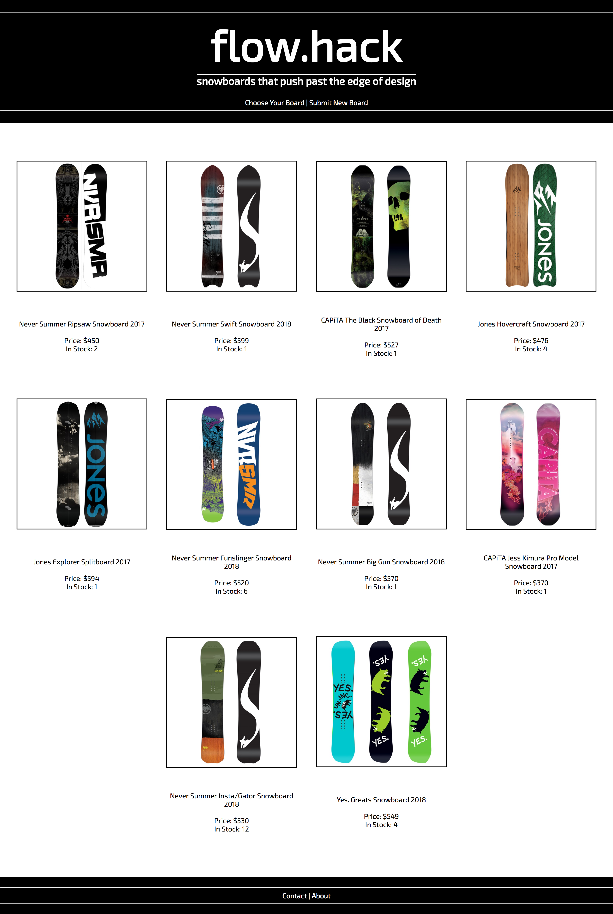
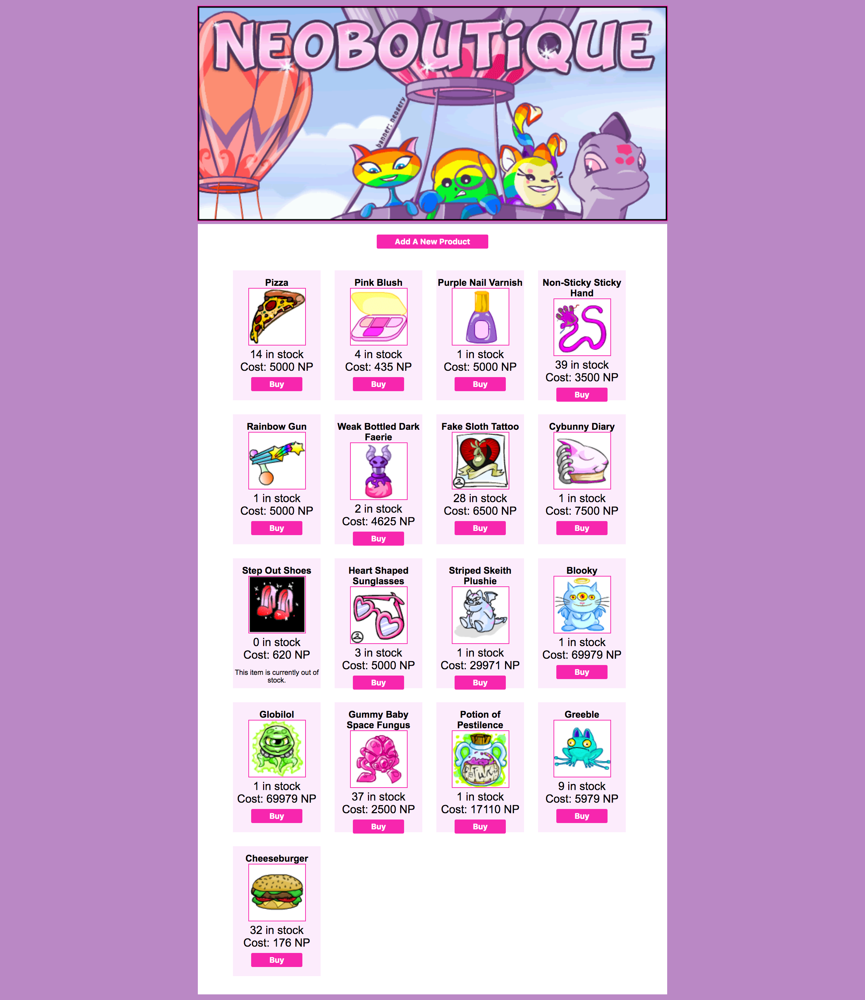

# Full Stack Store App

This application should adhere to the guidelines and rubric presented in the [Full Stack Personal Portfolio Project](https://github.com/pursuit-curriculum/project-full-stack-portfolio)

This readme is an example of how one could implement all the features required for the project when the theme is an online store.

The store will filled with products. Choose any theme you want:

- Soup
- Collectable rubber bands
- $1000 Store (no items worth less than $1000)

Or anything else you want.

## User Stories

The user stories encompass both back-end and front-end implementation:

1. A user can see a list of products to buy.
1. A user can click on a product and see a detailed view.
1. A user can click on the new button that takes me to a new form that lets the user create a new product.
1. After clicking the submit button on the new form, it takes the user to a view that confirms the product has been created.
1. A user can click on a button to see a pre-filled edit form and edit a product.
1. After editing the product, a user is taken to a view that confirms the product has been updated.
1. A user can delete a product.
1. A user can visit this app from a provided URL on the internet that uses data from the express API.
1. A user can [choose a new feature you have not built or that has not been demonstrated in class - ask your instructor for more guidance, if needed].

## Example RESTful Routes

|  #  | Action  |      URL      | HTTP Verb |    CRUD    |                Description                |
| :-: | :-----: | :-----------: | :-------: | :--------: | :---------------------------------------: |
|  1  |  Index  |   /products   |    GET    |  **R**ead  |   Get a list (or index) of all products   |
|  2  |  Show   | /products/:id |    GET    |  **R**ead  | Get an individual view (show one product) |
|  3  | Create  |   /products   |   POST    | **C**reate |           Create a new product            |
|  4  | Destroy | /products/:id |  DELETE   | **D**elete |             Delete a product              |
|  5  | Update  | /products/:id |    PUT    | **U**pdate |             Update a product              |

 

The model will have, at minimum, these following attributes:

- `id` - serial primary key
- `name` - a string, required
- `description` - a string
- `price` - a number
- `rating` - a number between 0 and 5
- `featured` - a boolean

Consider:

- adding a url for an image
- color
- dimensions/size

Or anything else that makes sense for your store.

## Example Stores

Inspiration 1

Inspiration 2

